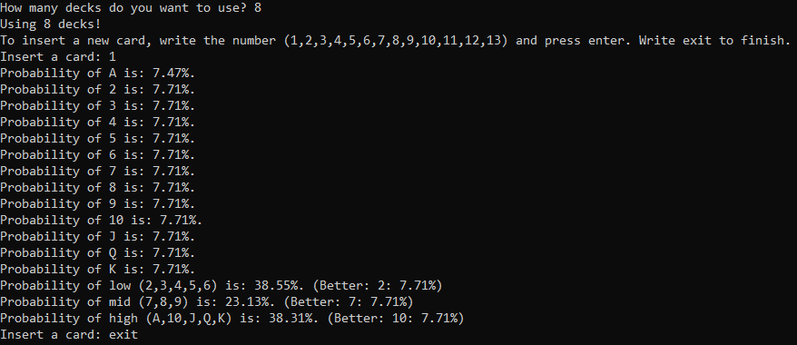

# Black Jack Probabilities



This simple project consists of counting cards in the game of Black Jack and giving the probability, for each card, that it will be drawn.

The project is just a js file. It is code that is ready to be expanded, for example with a graphical interface. Have fun!

## Run it

Go to the project directory:

```bash
  cd Black-Jack-Probabilities
```

Run the project:

```bash
  node blackJack.js
```

## Authors

- [@malvaphe](https://www.github.com/malvaphe)
